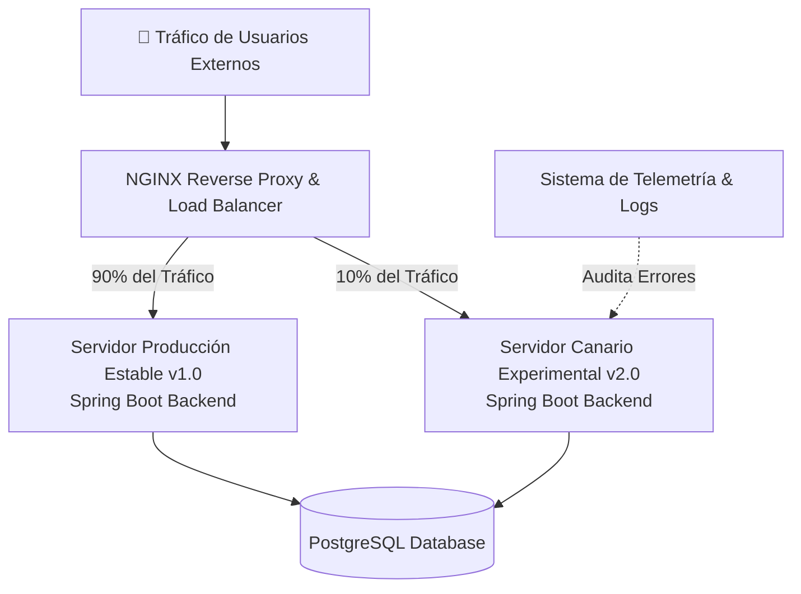

# 🏢 UAO - SERVICIUDAD Cali: Sistema Empresarial con Despliegues Canarios (Canary Deploy)

[](https://www.uao.edu.co/)
[](https://github.com/EduardCY/UAO-Software2-ServiCiudad-CanaryDeploy)
[](https://spring.io/)
[](https://www.docker.com/)
[](https://nginx.org/)
[](LICENSE)
[](https://github.com/EduardCY)

> **Sistema de Información Empresarial para la Gestión de Servicios Públicos y Ciudadanos (`SERVICIUDAD-CALI`)**, implementado con arquitectura Spring Boot, PostgreSQL, contenedorización Docker y una estrategia de **Despliegue Canario (Canary Deployment)** ponderado con NGINX para actualización sin caída de servicio (*Zero-Downtime Deployment*).

---

## 🎯 Arquitectura de Despliegue Canario (Canary Routing)



---

## 📁 Estructura del Repositorio

* **[`SERVICIUDAD-CALI/`](SERVICIUDAD-CALI/)**: Aplicación Spring Boot completa (`pom.xml`, endpoints REST, lógica de negocio, migraciones SQL, suites de prueba y configuraciones de Docker Compose).
* **[`ProyectoFinal_Original/`](ProyectoFinal_Original/)**: Justificación teórica, informes de calidad de software y documentación académica de soporte.

---

## 🚀 Puesta en Marcha

```bash
git clone https://github.com/EduardCY/UAO-Software2-ServiCiudad-CanaryDeploy.git
cd UAO-Software2-ServiCiudad-CanaryDeploy/SERVICIUDAD-CALI

# Ejecutar con Docker Compose
docker compose up -d --build
```

---

## 👨‍💻 Autor

* **Autor:** Eduard Criollo Yule ([@EduardCY](https://github.com/EduardCY))
* **Licencia:** [MIT](LICENSE).
